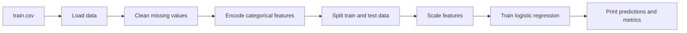

<h1 align="center">Titanic Survival Prediction</h1>

<p align="center">
	A compact machine learning project that predicts passenger survival on the Titanic using a logistic regression model.
</p>

<p align="center">
	
	
	
</p>

---

## Overview

This project reads the Titanic training data, prepares the features, trains a baseline classifier, and prints standard evaluation metrics.

## Project Structure

- `titanic.py` - end-to-end training and evaluation script
- `train.csv` - Titanic training dataset

## Quick Start

Install the required packages:

```bash
pip install numpy pandas scikit-learn
```

Run the script:

```bash
python titanic.py
```

## Workflow



## What The Script Does

1. Loads the dataset from `train.csv`.
2. Drops columns that are not used in the current model.
3. Fills missing values in `Age` and `Embarked`.
4. Encodes `Sex` as numeric values.
5. One-hot encodes `Embarked`.
6. Splits the data into features and target values.
7. Standardizes the feature values.
8. Trains a logistic regression classifier.
9. Prints predictions, accuracy, confusion matrix, and a classification report.

## Output

When the script finishes, you should see:

- the model predictions for the test set
- overall accuracy
- a confusion matrix
- precision, recall, and F1-score values

## Notes

This is a baseline model meant for learning and experimentation. It can be improved by keeping more informative features, trying additional models, and adding a reusable preprocessing pipeline.

## Next Improvements

- keep features such as `Fare`
- compare models like Random Forest, XGBoost, and SVM
- tune hyperparameters with cross-validation
- turn preprocessing into a reusable pipeline
